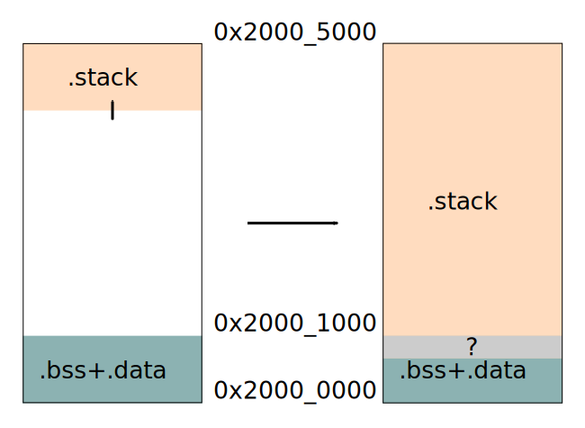
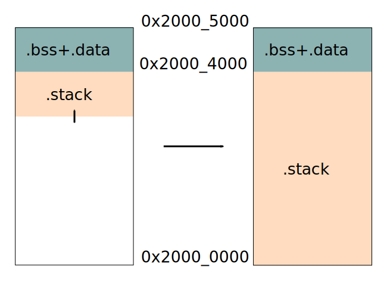

<!-- _class: lead -->
<!-- paginate: skip -->

# Embedded Rust


**Introduction to Rust for C Developers**
 By: Eicke Hecht

<style>
  img {
    background-color: transparent;
  }
</style>

---

# Rust on embedded devices

- Introduction to embedded Rust development
- Setup embedded Rust tooling
- Explore various levels of abstraction within the embedded Rust ecosystem
- Logging with defmt
- Testing with defm and embedded-test

---

# Tooling

- cross compilation
- probe-rs
- flip-link

---

# Cross compilation

- Rust uses the LLVM compiler
- Cross compilation is tightly integrated into cargo

```shell
rustup target add thumbv7em-none-eabihf
cargo build --target thumbv7em-none-eabihf
```

---

# Automating cross compilation

Cross compilation can be setup for a crate or workspace using `rust-toolcahin.toml`

```toml
[toolchain]
channel = "1.82"
components = [ "rust-src", "rustfmt", "llvm-tools" ]
targets = [
    "thumbv7em-none-eabihf",
]
```

---

# probe-rs

- Tool to programm, erase and debug an embedded target
- Print to STDOUT via RTT and defmt encoding when using probe-rs run.
- cargo-flash can be used to just flash a target
- cargo-embed can be used to get a full RTT terminal

```shell
cargo install probe-rs-tools --locked
```

---

# probe-rs supported debuggers

- STLink
- Segger JLink
- FTDI based JTAG probes
- USB-JTAG in ESP32

[preobe-rs setup](https://probe.rs/docs/getting-started/probe-setup/)

---

# probe-rs VSCode plugin

- use probe-rs via the DAP interface from VSCode

---

# Use probe-rs with cargo run

Create a `.cargo/config.toml`

```toml
[target.'cfg(all(target_arch = "arm", target_os = "none"))']
# replace STM32F429ZITx with your chip as listed in `probe-rs chip list`
runner = "probe-rs run --chip STM32F777ZITx"

[build]
target = "thumbv7em-none-eabihf"
```

---

# probe-rs VSCode plugin

- use probe-rs via the DAP interface from VSCode

---

# flip-link

- Used to link the applications

```shell
cargo install flip-link
```

and add this to `.cargo/config.toml`

```toml
rustflags = [
  "-C", "linker=flip-link",
  "-C", "link-arg=-Tlink.x",
  "-C", "link-arg=--nmagic",
]
```

---

## Problem

- **Bare metal Rust programs may not be memory safe in presence of stack overflows.**
- Example: Rust programs based on v0.6.x of the cortex-m-rt crate.

```rust
fn main() {
    let _x = fib(100);
}

#[inline(never)]
fn fib(n: u32) -> u32 {
    let _use_stack = [0xAA; 1024]; // allocate and initialize 4 kilobytes of stack memory

    if n < 2 {
        1
    } else {
        fib(n - 1) + fib(n - 2) // recursion
    }
}
```

---

# Overflow

- Left: Default memory layout of ARM Cortex-M programs
- Right: Stack overflow condition



---

# Solution: Flipped Memory Layout

- Place the stack below the .bss + .data region.
- Ensure the stack does not collide with static variables.
- Collide with the boundary of the physical RAM memory region instead.

---

# Flipped memory layout



---

# flip-link Implementation

- Adds zero-cost stack overflow protection.
- Produces the flipped memory layout.
- Handles stack overflow conditions with a HardFault exception handler.

---

# Blinking an LED with Embedded Rust

- Goal: Blink an LED on a microcontroller
- Explore various levels of abstraction within the embedded Rust ecosystem

---

# Low-Level LED Control

- Blinking an LED is the "Hello World" of embedded programming
- We will use a **Nucleo-144** with an STM32F767 microcontroller
- To blink an LED, control pins Row 1 and Column 1 by setting digital outputs

---

# Unsafe Rust for Direct Memory Access

- Rust ensures memory safety with the **borrow checker**
- When direct memory access is needed, we use **unsafe** Rust
- Unsafe blocks are used for operations that the borrow checker cannot verify

```rust
unsafe {
    let ptr = 0x50000000 as *mut u32;
    *ptr = 0x1;  // Direct memory write
}
```

- Only use unsafe when absolutely necessary

---

# Microcontroller Pin Configuration

- Use GPIO to control pins
- Identify pins using board schematics:
  - **User LD2**: a blue user LED is connected to PB7.
- GPIO pins are configured by writing to memory-mapped registers
- Memory safety: Use Rust's `unsafe` block to write directly to registers

```rust
const GPIOB_ODR: *mut u32 = 0x4002_0414 as *mut u32; // GPIOB output data register
unsafe {
  let current_state = read_volatile(GPIOB_ODR);
  if current_state & (1 << 7) == 0 {
      // Set PB7 high
      write_volatile(GPIOB_ODR, current_state | (1 << 7));
  } else {
      // Set PB7 low
      write_volatile(GPIOB_ODR, current_state & !(1 << 7));
  }
}
```

---

# Peripheral Access Crates (PAC)

- PACs provide access to microcontroller peripherals
- These crates offer safer abstractions over low-level operations
- Automatically generated from **SVD** files (standardized peripheral descriptions)

---

# Peripheral Access Crates (PAC)

## Example

```rust
let peripherals = pac::Peripherals::take().unwrap();
loop {
        if dp.GPIOB.odr.read().odr7().bit_is_clear() {
            // Set PB7 high
            dp.GPIOB.bsrr.write(|w| w.bs7().set_bit());
        } else {
            // Set PB7 low
            dp.GPIOB.bsrr.write(|w| w.br7().set_bit());
        }
}

```

- Register access is now type-safe and more readable

---

# Hardware Abstraction Layer (HAL)

- The HAL provides a higher-level abstraction built on top of the PAC
- HALs make common tasks, such as configuring GPIO, much simpler and safer
- Example of blinking an LED using a HAL:

```rust
let mut pin = gpioa.pa5.into_push_pull_output();
loop {
    pin.set_high().unwrap();
    delay_ms(1000);
    pin.set_low().unwrap();
    delay_ms(1000);
}
```

- HAL reduces the complexity of peripheral interactions

---

# Board Support Package (BSP)

- BSPs extend the HAL and PAC by including board-specific configurations
- Simplifies working with complex boards like the Micro:bit V2
- Example using a BSP:

```rust
let mut board = bsp::Board::new;
board.led1.on();
```

- Convenient for managing multiple peripherals on a specific board

---

# Writing a Board Support Package

- Create a Board struct

```rust
pub struct Board {
    pub led1: Led,
    pub led2: Led,
    pub led3: Led,
    pub button: Button,
}
```

and implement the `new()` function to initialize your board

```rust
impl Board {
    pub fn new() -> Self {
        ...
        Self { led1, led2, led3, button }

    }
}
```

---

# Abstract the underlying hardware

- e.g. Write a LED driver that provides a `on()` and `off()` function
- Writing generic drivers can be done using the `embedded-hal` traits

```rust
pub struct Led {
    pin: Box< dyn OutputPin<Error = Infallible>>
}

impl Led {
    pub fn new(pin: impl OutputPin< Error = Infallible> + 'static) -> Self{
        Led { pin: Box::new(pin) }
    }
    pub fn on(&mut self){
        let _ = self.pin.set_high();
    }
    pub fn off(&mut self){
        let _ = self.pin.set_low();
    }
}
```

---

# Layers of Embedded Rust


---

# Interrupts

- Handling with interrupts in Rust requires some effort to avoid using a lot of unsafe code

```rust
#[entry]
fn main() -> ! {
    ...
    // Push button configuration
    let mut syscfg = pac_periph.SYSCFG;
    let mut exti = pac_periph.EXTI;
    let gpioc = pac_periph.GPIOC.split();
    let mut button = gpioc.pc13.into_floating_input();
    button.make_interrupt_source(&mut syscfg, &mut rcc.apb2);
    button.trigger_on_edge(&mut exti, Edge::Rising);
    button.enable_interrupt(&mut exti);

    // Save information needed by the interrupt handler to the global variable
    free(|cs| {
        BUTTON_PIN.borrow(cs).replace(Some(button));
    });

    // Enable the button interrupt
    unsafe {
        NVIC::unmask::<interrupt>(interrupt::EXTI15_10);
    }

    loop {
        // Wait for the interrupt to fire
        free(|cs| {
            if SEMAPHORE.borrow(cs).get() == false {
                // Toggle debug LED
                led1.toggle();

                SEMAPHORE.borrow(cs).set(true);
            }
        });
    }
}
```

---

# Interrupt Handler

```rust
#[interrupt]
fn EXTI15_10() {
    free(|cs| {
        match BUTTON_PIN.borrow(cs).borrow_mut().as_mut() {
            // Clear the push button interrupt
            Some(b) => b.clear_interrupt_pending_bit(),

            // This should never happen
            None => (),
        }

        // Signal that the interrupt fired
        SEMAPHORE.borrow(cs).set(false);
    });
}
```

---

# Synchronization with `SEMAPHORE`

```rust
static SEMAPHORE: Mutex<Cell<bool>> = Mutex::new(Cell::new(true));
```

- The semaphore is used for synchronization between the main thread and the interrupt handler.
- It is a boolean flag wrapped in a `Cell` and protected by a `Mutex` to ensure safe access from both the main thread and the interrupt handler.
- The main thread checks the semaphore to determine if the interrupt has fired.
- The interrupt handler sets the semaphore to signal that the interrupt has occurred.

---

# The `BUTTON_PIN`

```rust
static BUTTON_PIN: Mutex<RefCell<Option<PC13<Input<Floating>>>>> = Mutex::new(RefCell::new(None));
```

- The button pin represents the GPIO pin connected to the push button.
- It is wrapped in a `RefCell` and protected by a `Mutex` to allow mutable access from both the main thread and the interrupt handler.
- It has to be static and the pin intialization happens at runtime thus we have to wrap it in an `Option`

---

# Logging

- Logging is an integral part to Software development
- Embedded systems logging can use substantial amount of resources

---

# RTT (Real-Time Transfer) I/O Protocol

- **Target Side Implementation**:
  - Implements input and output via a debug probe.
  - Uses in-memory ring buffers and polling.

- **Advantages**:
  - Enables debug logging from the microcontroller with minimal delays.
  - Non-blocking, making it suitable for real-time applications.
  - Avoids delays associated with semihosting.

- **Use Cases**:
  - Real-time applications where minimal logging delay is crucial.
  - Situations where traditional logging methods (e.g., UART) are too slow or intrusive.

---

# Use rtt with Rust

- Add the rtt-target crate

```shell
cargo add rtt-target
```

- and use it in your main() function

```rust
use rtt_target::{rtt_init_print, rprintln};

fn main() {
    rtt_init_print!();
    loop {
        rprintln!("Hello, world!");
    }
}
```

---

# Size considerations

- Debug strings are on the target in the .rodata section
- Code for formatting strings is on the target with the apllication code

```plaintext
cargo size --release -- -A
Finished `release` profile [optimized] target(s) in 0.05s
rtt-logging  :
section             size        addr
.itcm                  0         0x0
.dtcm                  0  0x20000000
.vector_table        504   0x8000000
.text               5296   0x80001f8
.rodata              560   0x80016a8
.data                  0  0x2007fbb8
.gnu.sgstubs           0   0x80018e0
.bss                1092  0x2007fbb8
.uninit                0  0x2007fffc
.comment             153         0x0
.ARM.attributes       58         0x0
Total               7663

```

---

# Adding floats

- Logging a single float incrases the size from 7kB to 35kB

```plaintext
cargo size --release --features float -- -A
Finished `release` profile [optimized] target(s) in 0.05s
rtt-logging  :
section              size        addr
.itcm                   0         0x0
.dtcm                   0  0x20000000
.vector_table         504   0x8000000
.text               29792   0x80001f8
.rodata              4032   0x8007658
.data                   0  0x2007fbb8
.gnu.sgstubs            0   0x8008620
.bss                 1092  0x2007fbb8
.uninit                 0  0x2007fffc
.comment              153         0x0
.ARM.attributes        58         0x0
Total               35631
```

---

# Logging with defmt

- defmt stands for deferred formatting
- Formatting happens on the host
- Debug strings and formatting code lives on the host

---

# Setting Up defmt

- Add `defmt` as a dependency:

  ```sh
  cargo add defmt
  ```

- Many crates provide a defmt feature to provide logging for their function and formatting information for the provided types

---

# Linker Script

- Custom linking process is required.
- Add the defmt.x linker script to the .cargo/config.toml file.

```toml
# .cargo/config.toml
[target.thumbv7m-none-eabi]
rustflags = [
  # --- KEEP existing `link-arg` flags ---
  "-C", "link-arg=-Tlink.x",
  "-C", "link-arg=--nmagic",

  # --- ADD following new flag ---
  "-C", "link-arg=-Tdefmt.x",
]
```

---

# Global Logger

- The application must link to or define a global_logger.

### Provided Global Loggers

- `defmt-rtt`: Logs over RTT.
- `defmt-itm`: Logs over ITM (Instrumentation Trace Macrocell) stimulus port 0.
- `defmt-semihosting`: Logs over semihosting (for testing on QEMU).

---

# Implement formatting for your custom types

- `defmt` implements logging for all standard types
- If your struct is composed only of types where the `Format`trait you can derive it

```rust
use defmt::Format; // <- derive attribute

#[derive(Format)]
struct S1<T> {
    x: u8,
    y: T,
}
```

---

# Size with defmt

- Inludes formatting a float
- Size dereased from 35kB to 9kB

```plaintext
cargo size --release --bin hello -- -A
Finished `release` profile [optimized] target(s) in 0.39s
hello  :
section             size        addr
.itcm                  0         0x0
.dtcm                  0  0x20000000
.vector_table        504   0x8000000
.text               6740   0x80001f8
.rodata              756   0x8001c4c
.data                 56  0x2007fbc0
.gnu.sgstubs           0   0x8001f80
.bss                   8  0x2007fbf8
.uninit             1024  0x2007fc00
.defmt                 8         0x0
.comment             153         0x0
.ARM.attributes       58         0x0
Total               9307
```

---

# How does it work

- Each log message has a json encoded data
- The target just sends the identifier of the log message with the raw data required for formatting

```plaintext
cargo objdump --release --bin hello -- -D -j .defmt
...
00000003 <{"package":"defmt-example","tag":"defmt_info","data":"i = {}","disambiguator":"2667771445449800550","crate_name":"hello"}>:
       3: 0000          movs    r0, r0
00000004 <{"package":"panic-probe","tag":"defmt_error","data":"{}","disambiguator":"3281125884690968605","crate_name":"panic_probe"}>:
       4: 0000          movs    r0, r0
00000005 <{"package":"defmt-example","tag":"defmt_println","data":"Hello, world!","disambiguator":"1700592475692992850","crate_name":"hello"}>:
....
```

---

# Conclusion: Embedded Rust

- We explored different approaches to blink an LED using Rust
- Started with low-level register manipulation using `unsafe` Rust
- Moved up to safer abstractions using PAC, HAL, and BSP
- Each layer offers more safety and ease of use, while maintaining performance
- Handling interrupts using safe Rust
- Using deferred formatting for logging
