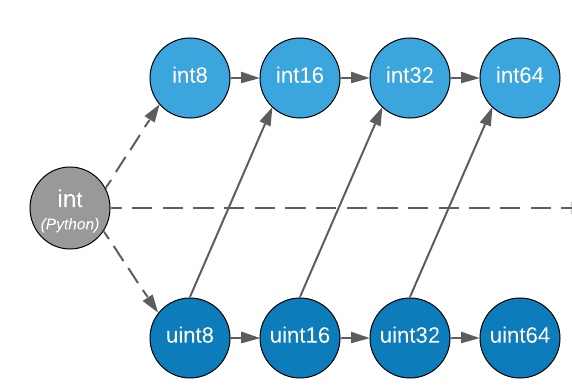

<!-- _class: lead -->
<!-- paginate: skip -->

# Rust


**Introduction to Rust for C Developers**
 By: Eicke Hecht

<style>
  img {
    background-color: transparent;
  }
</style>

---

# Why Rust?

**Rust’s Popularity Explained**

- Memory safety without a garbage collector
- Concurrency without data races
- Modern syntax features in a system level language
- C like performance
- Growing popularity: Rust has topped StackOverflow’s “Most Loved” language list since 2016

---

# Common Ground Between C and Rust

**Familiar Concepts for C Developers**

- Systems-level control over memory and hardware
- No garbage collector, like C
- Compiled language

---

# This talk in a Nutshell

**Learning by Example**

- As many Rust snippet as possible.
- This is going to be fast.


---

# Install Rust

## `curl https://sh.rustup.rs | sh`

(or visit [rustup.rs](https://www.rustup.rs))

---

# Basic Rust

`let` introduces a variable binding:

```rust
let x;  // declare "x"
x = 42; // assign 42 to "x"
```

This can be written as a single line

```rust
let x = 42;
```

---

# Basic Rust

Types can be annotated

```rust
let x: i32;
x = 42;
```

This can also be written as a single line

```rust
let x: i32 = 42;
```

---



---

# Basic Rust

You can't access uninitialised variables

```rust
let x;
foobar(x); 
// borrow of possibly-uninitialized `x`
x = 42;
```

However, doing this is completely fine:

```rust
let x;
x = 42;
foobar(x); 
```

---

# Basic Rust

```rust
let pair = ('a', 17);
pair.0; // this is 'a'
pair.1; // this is 17
```

Or, with explicit type annotation:

```rust
let pair: (char, i32) = ('a', 17);
```

---

# Basic Rust

```rust
let (some_char, some_int) = ('a', 17);
assert!(some_char, 'a');
assert!(some_int, 17);
```

```rust
let (l, r) = slice.split_at(middle);
```

```rust
let (_, right) = slice.split_at(middle);
```

---

# Basic Rust

```rust
let x = 3;
let y = 5;
let z = y + x;
```

The semi-colon marks the end of a statement.

---

# Basic Rust

Statements semicolons can span multiple lines

```rust
let x = vec![1, 2, 3, 4, 5, 6, 7, 8]
    .iter()
    .map(|x| x + 3)
    .fold(0, |x, y| x + y);
```

---

# Basic Rust

`f -> void`

```rust
fn greet() {
    println!("Hi there!");
}
```

`f -> i32`

```rust
fn fair_dice_roll() -> i32 {
    4
}
```

---

# Basic Rust

```rust
let x = "out";
{
    // this is a different `x`
    let x = "in";
    println!("{}", x);
}
println!("{}", x);
```

This prints "in", then "out"

---

# Basic Rust

```rust
// this:
let x = 42;

// is equivalent to this:
let x = { 42 };
```

---

# Basic Rust

```rust
let x = {
    let y = 1; // first statement
    let z = 2; // second statement
    y + z // this is the *tail* 
};
```

---

# Basic Rust

```rust
fn fair_dice_roll() -> i32 {
    return 4;
}

fn fair_dice_roll() -> i32 {
    4
}
```

these are equivalent

---

# Basic Rust

```rust
fn fair_dice_roll() -> i32 {
    if feeling_lucky {
        6
    } else {
        4
    }
}
```

if conditionals are also expressions

---

# Basic Rust

```rust
fn fair_dice_roll() -> i32 {
    match feeling_lucky {
        true  => 6,
        false => 4,
    }
}
```

A match is also an expression, not a statement

---

# Basic Rust

Dots are typically used to access fields of a value:

```rust
let a = (10, 20);
a.0; // == 10

let amos = get_some_struct();
amos.nickname; // == "fasterthanlime"
```

Or call a method on a value:

```rust
let nick = "fasterthanlime";
nick.len(); // this is 14
```

---

# Namespaces

```rust
let least = std::cmp::min(3, 8);
```

Approximately:

```rust
crate::file::function
```

---

# Namespaces

```rust
use std::cmp::min;

let least = min(7, 1); // this is 1
```

---

# Namespaces

```rust
let x = "amos".len(); // 4
let x = str::len("amos"); // also 4
```

Types are namespaces too, and methods can be called as regular functions:
str is a primitive type, but many non-primitive types are also in scope by default

---

Structs are declared with the struct keyword:

```rust
struct Number {
    odd: bool,
    value: i32,
}
```

They can be initialised using literals:

```rust
let x = Number { odd: false, value: 2 };
let y = Number { value: 3, odd: true};
// the order does not matter
```

---

# Structs

```rust
struct Number {
    odd: bool,
    value: i32,
}
```

---

# Structs

```rust
impl Number {
    fn is_positive(self) -> bool {
        self.value > 0
    }
}
```

You can declare methods on your own types

---

# Structs

```rust
let minus_two = Number {
    odd: false,
    value: -2,
};
println!("{}", minus_two.is_positive());
```

And then we can use our new methods like usual

---

# Generic types

Functions can be generic:

```rust
fn foobar<T>(arg: T) {
    // work with `arg`
}
```

```rust
fn foobar<L, R>(left: L, right: R) {
    // work with `left` and `right`
}
```

---

# Generic types

Structs can be generic too:

```rust
struct Pair<T> {
    a: T,
    b: T,
}
```

```rust
let p1 = Pair { a: 3, b: 9 };
// = Pair<i32>
let p2 = Pair { a: true, b: false };
// = Pair<bool>
```

Note that in this case, both a and b must be of the same type, T.

---

# Generic types

```rust
let mut v1 = Vec::new();
v1.push(1);
let mut v2 = Vec::new();
v2.push(false);
// v1 == Vec<i32>
// v2 == Vec<bool>
```

The standard library type Vec (Which is a heap-allocated array), is generic.

v1 is a vector of integers
v2 is a vector of booleans

---

# Generic types

```rust
fn main() {
    let v1 = vec![1, 2, 3];
    let v2 = vec![true, false, true];
}
```

Vec comes with a macro that gives us more or less "vec literals"
v1 is a vector of integers (i32 as usual)
and v2 is a vector of booleans

---

# Macros

- `name!()`
- `name![]`
- `name!{}`

All of these invoke a macro. Macros just expand to regular code.
You can recognise them by the bang at the end of the name.

---

# Macros

`println` is a macro

```rust
fn main() {
    println!("{}", "Hello there!");
}
```

```rust
fn main() {
    use std::io::{self, Write};
    io::stdout()
        .lock()
        .write_all(b"Hello there!\n")
        .unwrap();
}
```

---

# Error Handling

```rust
fn main() {
    panic!("This panics");
}
```

error

```markdown
thread 'main' panicked at 'This panics', src/main.rs:3:5
```

panic is also a macro. It violently stops execution with an error message, and the file name and line number of the error.

---

# Error Handling

```rust
fn main() {
    let o1: Option<i32> = Some(128);
    o1.unwrap(); // this is fine

    let o2: Option<i32> = None;
    o2.unwrap(); // this panics!
}
```

error

```markdown
thread 'main' panicked at
'called `Option::unwrap()` on a `None` value', 
src/libcore/option.rs:378:21
```

---

# Option

```rust
enum Option<T> {
    None,
    Some(T),
}
```

```rust
impl<T> Option<T> {
    fn unwrap(self) -> T {
        match self {
            Self::Some(t) => t,
            Self::None => panic!(...),
}}}
```

Option is not a struct - it's an enum, with two variants.
It panics when unwrapped and containing an error.

---

# Result

```rust
enum Result<T, E> {
    Ok(T),
    Err(E),
}
```

Result is also an enum, it can either contain something, or an error:
It also panics when unwrapped and containing an error.

---

# Error Handling

```rust
let s1 = str::from_utf8(
    &[240, 159, 141, 137]
);
println!("{:?}", s1);
```

```markdown
`Ok("🍉")`
```

```rust
let s2 = str::from_utf8(&[195, 40]);
println!("{:?}", s2);
```

```markdown
`OErr(Utf8Error { valid_up_to: 0, error_len: Some(1) })`
```

Functions that can fail typically return a Result

---

# Error Handling

```rust
let s = str::from_utf8(
    &[240, 159, 141, 137]).unwrap();
println!("{:?}", s);
```

```markdown
"🍉"
```

whereas...

```rust
str::from_utf8(&[195, 40]).unwrap();
```

```markdown
thread 'main' panicked at
'called `Result::unwrap()` on an `Err` value: 
`Utf8Error { valid_up_to: 0, error_len: Some(1) }`'
```

---

# Error Handling

```rust
let s = str::from_utf8(&[195, 40])
.expect("valid utf-8");
```

error

```markdown
thread 'main' panicked at 'valid utf-8:
`Utf8Error{ valid_up_to: 0, error_len: Some(1) }`'
```

Or you can use .expect(), for a custom error message before panicking.

---

# Error Handling

```rust
let melon = &[240, 159, 141, 137];
match str::from_utf8(melon) {
    Ok(s) => println!("{}", s),
    Err(e) => panic!(e),
}
// prints 🍉
```

You can also match and handle the error (or in this example, panic anyway!)

---

# Error Handling

```rust
let melon = &[240, 159, 141, 137];
match std::str::from_utf8(melon) {
    Ok(s) => println!("{}", s),
    Err(e) => return Err(e),
}
Ok(())
```

```markdown
(assuming inside `fn -> Result<(), std::str::Utf8Error>`)
```

---

# Error Handling

```rust
let melon = &[240, 159, 141, 137];
let s = str::from_utf8(melon)?;
println!("{}", s);
Ok(())
```

The question mark operator, at the end of Line 2, does the exact same thing as the larger match statement on the previous slide.
This is the normal rust error pattern in application code, where you're trying to just write the happy path, though the previous options are available to you when you need them.

---

# Iterators

```rust
let natural_numbers = 1..;
```

---

# Iterators

```rust
// 0 or greater
(0..).contains(&100); // true
// 20 or less than 20
(..=20).contains(&20)); // true
// only 3, 4, 5
(3..6).contains(&4)); // true
```

---

# Iterators

```rust
fn main() {
    for i in vec![52, 49, 21] {
        println!("I like number {}", i);
    }
}
```

output

```markdown
I like number 52
I like number 49
I like number 21
```

---

# Iterators

```rust
fn main() {
  for i in &[52, 49, 21] {
    println!("I like number {}", i);
  }
}
```

output

```markdown
I like number 52
I like number 49
I like number 21
```

---

# Iterators

Or a slice

```rust
fn main() {
    for c in "rust".chars() {
        println!("Give me a {}", c);
    }
}
```

output

```markdown
Give me a r
Give me a u
Give me a s
Give me a t
```

---

# Rust’s Detailed Error Reporting

- **rustc** provides very informative error messages, making it easier to debug issues.
- Helps developers fix issues **faster** and **safely**.

---

## Example: Error in Rust vs C

### C Error

```c
int main() {
    int* x = NULL;
    *x = 10; // Segmentation fault
    return 0;
}
```

- Fails at runtime
- **Error**: `Segmentation fault (core dumped)`
- Minimal information, doesn't explain why or where it failed.

---

## Rust Error Example

```rust
fn main() {
    let x = 10;
    let r1 = &x;
    let r2 = &mut x; // ERROR: cannot borrow `x` as mutable
}
```

---

### Rust's `rustc` Error

```text
error[E0502]: cannot borrow `x` as mutable because it is also borrowed as immutable
 --> src/main.rs:4:14
  |
3 |     let r1 = &x;
  |               -- immutable borrow occurs here
4 |     let r2 = &mut x;
  |              ^^^^^^ mutable borrow occurs here
5 |     println!("{}", r1);
  |                    -- immutable borrow later used here
```

- Error is caught at compile time
- Provides **line numbers** and clear explanations of **why** the error occurred.
- Suggests a solution and directs to `rustc --explain [ERROR_CODE]` for more details.

---

# Rust’s Memory Safety: Ownership and Borrowing

**C’s Manual Memory vs Rust’s Automated Approach**

- **C**: You must explicitly manage memory (`malloc`, `free`)
- **Rust**: Ownership and borrowing system ensures memory safety at compile-time

  ```c
  // C code example
  int *p = malloc(sizeof(int));
  *p = 10;
  free(p);
  ```

  ```rust
  {
    // Rust code example
    let x = Box::new(10); // No need to free manually
  }
  ```

---

# Borrowing in Rust

- **Ownership**: In Rust, each value has a unique owner.
- **Borrowing**: Allows temporarily "borrowing" a value without taking ownership.
  - **Immutable Borrowing** (`&T`):
    - Multiple references allowed.
    - No modification is allowed while borrowed.
  - Example:
  
    ```rust
    fn print_value(val: &i32) {
        println!("Value: {}", val);
    }
    
    let x = 10;
    print_value(&x); // Borrow `x`
    ```

---

# Mutable Borrowing

- **Mutable Borrowing** (`&mut T`):
  - Allows exclusive mutable access to a value.
  - Only one mutable reference is allowed at a time.
  - Ensures no data races and memory safety.
  - Example:

    ```rust
    fn increment(val: &mut i32) {
        *val += 1;
    }
    
    let mut x = 10;
    increment(&mut x); // Mutably borrow `x`
    println!("{}", x); // 11
    ```

---

# Borrowing Rules

- **Rules**:
  - You can have either **one mutable** reference or **many immutable** references, but not both at the same time.
  - Ensures data integrity and prevents race conditions.
- Example violation:

    ```rust
    let mut x = 10;
    let r1 = &x;
    let r2 = &mut x; // Error: Cannot borrow `x` as mutable because it’s already borrowed as immutable
    ```

- The borrow checker ensures these rules at compile time.

---

# Rust’s Memory Safety: Lifetimes

  ```rust
  fn main() {
      let r;

      {
          let x = 5;
          r = &x;
      }
      // x was dropped
      println!("r: {r}"); 
      // error x does not live long enough
  }
  ```

---

# Lifetimes explained

```text
error[E0597]: `x` does not live long enough
 --> src/main.rs:6:13
  |
5 |         let x = 5;
  |             - binding `x` declared here
6 |         r = &x;
  |             ^^ borrowed value does not live long enough
7 |     }
  |     - `x` dropped here while still borrowed
8 |
9 |     println!("r: {r}");
  |                  --- borrow later used here
  ```

  Rust ensures memory is freed automatically when the variable goes out of scope

---

# Lifetime problems

- The compiler sometimes needs help
- Example:

 ```rust
 fn main() {
  let string1 = String::from("abcd");
  let string2 = String::from("xyz");
  let result = longest(string1.as_str(), string2.as_str());
  println!("The longest string is {}", result);
 }

fn longest(x: &str, y: &str) -> &str {
  if x.len() > y.len() {
    x
  } else {
    y
  }
}
 ```

---

# Lifetimes

- Fixed:

 ```rust
 fn main() {
  let string1 = String::from("abcd");
  let string2 = String::from("xyz");
  let result = longest(string1.as_str(), string2.as_str());
  println!("The longest string is {}", result);
 }

fn longest<'a>(x: &'a str, y: &'a str) -> &'a str {
  if x.len() > y.len() {
    x
  } else {
    y
  }
}
 ```

 ---

# Concurrency in Rust vs C

**Concurrency Without Fear**

- **C**: Threads and locks, manual management prone to errors
- **Rust**: Concurrency managed via ownership and borrowing

  ```rust
  // Safe multithreading in Rust
  let handle = std::thread::spawn(|| {
      println!("Hello from a thread!");
  });
  handle.join().unwrap();
  ```

  Rust's compiler enforces data race prevention at compile-time

---

# Zero-Cost Abstractions

**Performance: Rust vs C**

- Both languages offer low-level control and efficiency
- **Rust**: Zero-cost abstractions, meaning high-level constructs like iterators compile down to efficient code

  ```rust
  // Rust zero-cost abstraction example
  let squares: Vec<_> = (0..10).map(|i| i * i).collect();
  ```

  This abstraction performs just as well as if you wrote the loop manually

---

# Error Handling in Rust

**Safe and Structured Error Handling**

- **C**: Relies on error codes or global variables (`errno`)
- **Rust**: Uses `Result` and `Option` types for explicit error handling

  ```rust
  fn divide(a: i32, b: i32) -> Result<i32, &'static str> {
      if b == 0 {
          Err("Division by zero")
      } else {
          Ok(a / b)
      }
  }
  ```

### Tooling and Ecosystem

**Rust’s Tooling: Cargo**

- **C**: Uses `make` and manual dependency management
- **Rust**: `Cargo` for build automation, dependency management, testing, and documentation
  - Integrated tools for benchmarking, fuzzing, and formatting
  - Rich ecosystem via `crates.io`
  
---

# Typical Rust Project Structure

A typical Rust project structure generated by Cargo looks like this:

```
my_project/
│
├── Cargo.toml    # Project metadata and dependencies
├── Cargo.lock    # Versions of dependencies (auto-generated)
└── src/
    ├── main.rs   # The main entry point of the program
    └── lib.rs    # Code for reusable libraries (optional)
```

- **Cargo.toml**: Specifies project details like dependencies.
- **Cargo.lock**: Locks specific versions of dependencies.
- **src/**: Contains Rust source code (`main.rs` for binaries, `lib.rs` for libraries).

---

# Cargo: Rust’s Build and Package Manager

**Cargo** is Rust's integrated tool for managing:

- **Building**: Compiles your code (`cargo build`).
- **Testing**: Runs tests (`cargo test`).
- **Documentation**: Generates documentation (`cargo doc`).
- **Dependencies**: Manages third-party libraries (`crates.io`).

- Key Cargo commands:
  - `cargo new my_project`: Creates a new project.
  - `cargo run`: Compiles and runs the project.
  - `cargo build --release`: Builds optimized code for release.

---

# Cargo.toml Explained

The **Cargo.toml** file is at the core of every Rust project. It contains:

```toml
[package]
name = "my_project"
version = "0.1.0"
edition = "2021"

[dependencies]
serde = "1.0"  # Example dependency
```

- **[package]**: Contains project metadata (name, version, etc.).
- **[dependencies]**: Lists external libraries (crates) with version numbers from [crates.io](https://crates.io).
- Cargo makes managing dependencies straightforward and handles fetching, compiling, and updating them.

---

# Why Cargo matters?

- **All-in-one tool**: From building to testing, Cargo simplifies Rust development.
- **Efficient dependency management**: Cargo handles versioning and builds with ease.
- **Community-driven ecosystem**: Crates.io hosts a wide range of packages for use in Rust projects.

---

# Attribution

This talk is heavily based on:


- [fasterthanli.me/articles/a-half-hour-to-learn-rust](https://fasterthanli.me/articles/a-half-hour-to-learn-rust)
- [Rust for the impatient](https://www.youtube.com/watch?v=br3GIIQeefY)

---

# Conclusion

**Why Rust is Worth Exploring for C Developers**

- Memory safety without garbage collection
- Competitive performance, even in systems programming
- Increasingly adopted in industry for reliability and concurrency
  - Rust offers solutions to longstanding challenges in C development like memory safety and concurrency bugs.
- Rich ecosystem

---
<!-- _class: lead -->
<!-- paginate: skip -->

# Thank you for your attention

Continue learning Rust
- [rust book](https://doc.rust-lang.org/book/)
- [rustlings](https://github.com/rust-lang/rustlings)
- [rust by example](https://doc.rust-lang.org/rust-by-example/)


